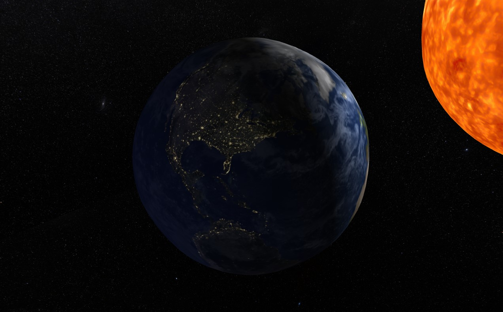
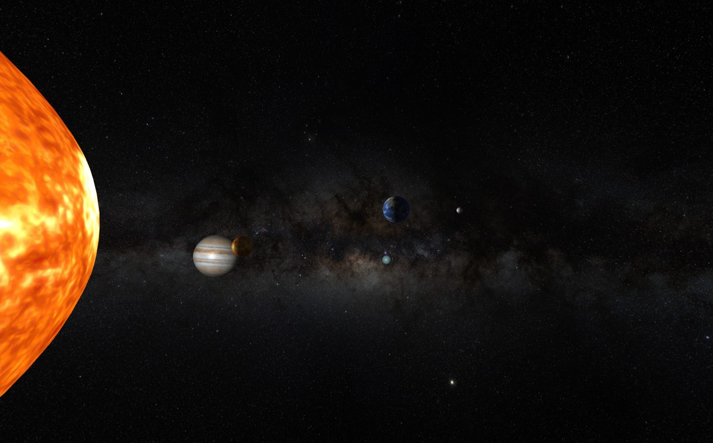
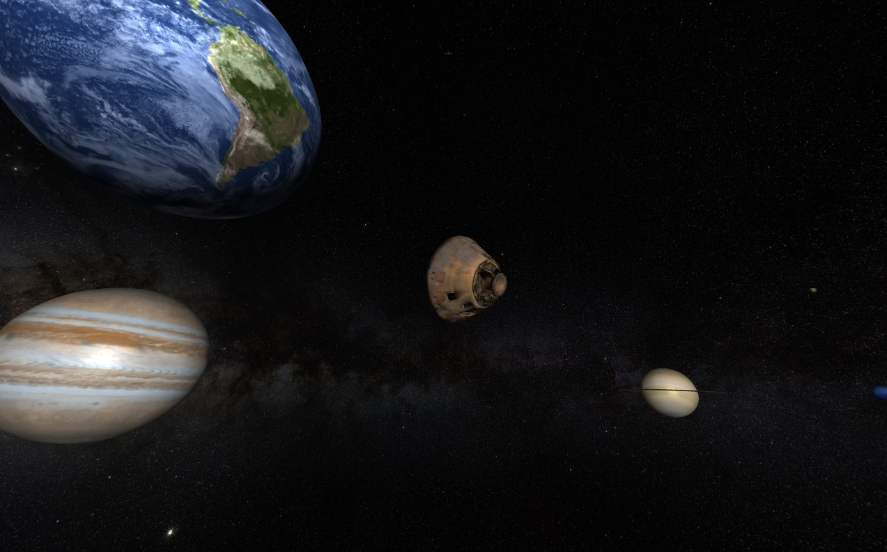

# Solar System Scene with OpenGL

    

    
    

A simple animated solar system scene with various miscellaneous interactions to play with. [More Screenshots](./screenshot/)

# Controls
| **Key**    | **Action**                                             |
|------------|--------------------------------------------------------|
| Esc        | Close Window                                           |
| Mouse      | Fly Through Camera View Direction                      |
| W          | Fly Forward / Model View Pitch Down                    |
| A          | Fly Left / Model View Yaw Left                         |
| S          | Fly Backward / Model View Pitch Up                     |
| D          | Fly Right / Model View Yaw Right                       |
| Left Shift | Fly Down                                               |
| Space      | Fly Up                                                 |
| Ctrl       | Switch Camera Mode \(fly Through / Model View Camera\) |
| R          | Randomise Orbit Angle                                  |
| F          | Toggle Player Torch Light                              |
| P          | Pause Animation                                        |
| <          | Slow Down Animation                                    |
| >          | Speed Up Animation                                     |
| \[         | Decrease FOV                                           |
| \]         | Increase FOV                                           |

# Implementation
Code is poorly written, due to the time constraint.
## Objects
- loaded directly from `.obj` files using custom parser `ObjFileReader`
    - a crude parser for personal use only
- complex objects are downloaded from free platforms and some I made in blender.
## Textures
- loaded using stbi library
- some 2k to 8k planet textures dowloaded from multiple sources
## Animation
- all data \(e.g. axial tilt, inclination, orbital period etc.\) regarding tranformation of bodies are gathered from wiki and can be found in [Excel Sheet](./BodiesConstants.xlsx)
- orbits are animated using custom circular or elipse shape orbit
- apart from scale, distance and orbit shape everything else regarding the angle and daylight cycle are accurate for all bodies.
    - e.g. earth spin roughly 365 per orbit, moon is tidally locked can be observed.
    - No physics implemented thus the animation will not be accurate.
## Shader
- phong
- spot light phong
- additonal shader code for night light texture of earth facing away from sun

# Dependencies
- OpenGL, GLFW are configured
- Visual Studio 2022
- Visual Studio 2019 Available in dedicated branch

# License
Licensed under the [MIT License](LICENSE).